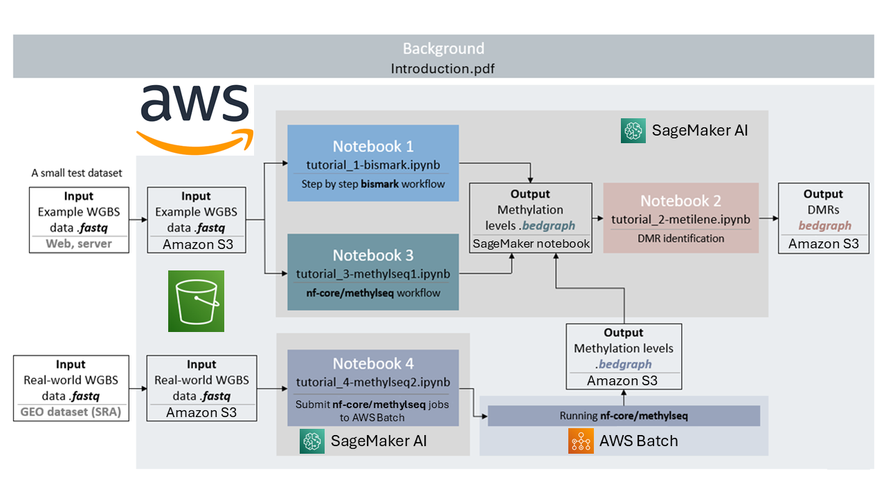
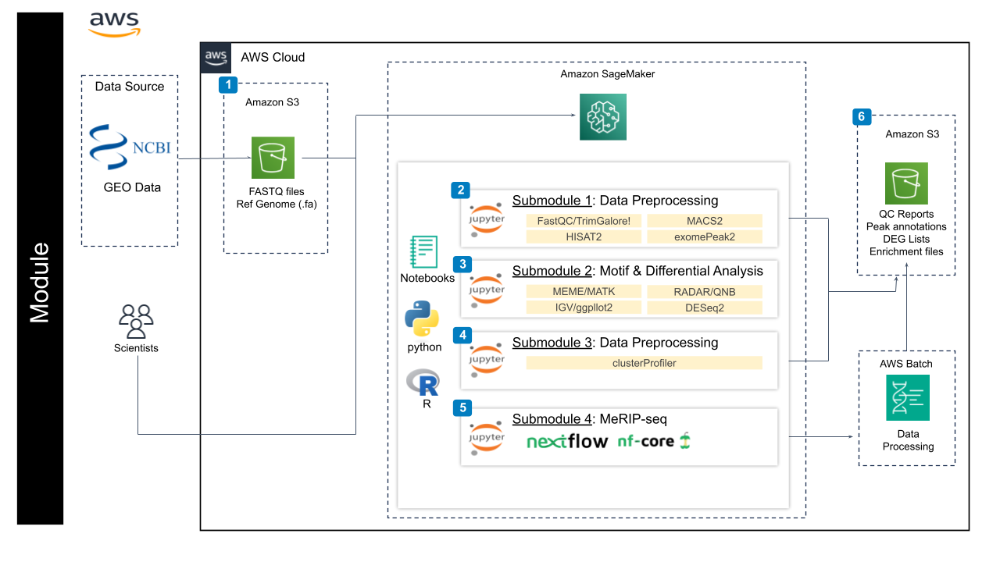

## **Contents**

+ [Overview](#overview)
+ [Getting Started](#getting-started)
+ [Architecture Design](#architecture-design)

## **Overview**

This module will show you how to run a whole genome bisulfite sequencing (WGBS) data analysis workflow on Google Cloud Platform (GCP). In addition to the overview given in this README you will find four Jupyter notebooks that help you understand the basics of the workflow to running large dataset using Google Batch in the cloud. To use this module, clone the parent repository, `git clone https://github.com/NIGMS/DNA-Methylation-Sequencing-Analysis-with-WGBS.git` and then navigate to the directory for this project. You will then see the following notebooks in your environment:

- **Introduction of DNA methylation** (`tutorial_0-introduction.pdf`): more background of DNA methylation and WGBS data analysis.

- **Notebook 1**  (`tutorial_1-bismark.ipynb`): using the Bismark workflow to extract the methylation percentage at each position from the raw FASTQ sequences. This tutorial will use a small example to walk through the process step by step.
(Running time: ~50 mins)
- **Notebook 2** (`tutorial_2-metilene.ipynb`): using metilene to identify differential methylated regions (DMRs) from the methylation profiles generated from Notebook 1. This workflow requests at least two samples.
(Running time: < 3 mins)
- **Notebook 3** (`tutorial_3-methylseq1.ipynb`): run the existing workflow methylseq developed by nf-core. This workflow is built using [Nextflow](https://www.nextflow.io/docs/latest/index.html), and is highly automated and portable.  
(Running time: ~50 mins)
- **Notebook 4** (`tutorial_4-methylseq2.ipynb`): run  the nf-core/methylseq workflow using Google Batch, which enables the workflows to use highly scalable and compliant infrastructure in the Google Cloud Platform.
(Running time: ~3 hrs)

This whole module will only cost you about $2.00 to run, assuming you tear down all resources upon completion.

Watch this [Introduction Video](https://youtu.be/S3ZIhO8k4ag) to learn more about the module.

## **Getting Started**

This repository contains several notebook files which serve as bioinformatics WGBS workflow tutorials. To view these notebooks on GCP, the following steps will guide you through setting up a virtual machine on Google Cloud Platform, downloading our tutorial files, and running those files.

### Optional: Creating a Nextflow Service Account
If you are using Nextflow outside of NIH CloudLab you must set up a service account and add your service account to your notebook permissions before creating the notebook. Follow section 2 of the accompanying [How To document](https://github.com/NIGMS/NIGMS-Sandbox/blob/main/docs/HowToCreateNextflowServiceAccount.md) for instructions. If you are executing this tutorial with an NIH CloudLab account your default Compute Engine service account will have all required IAM roles to run the nextflow portion.

### Creating a user managed notebook 

**1)** Follow the steps highlighted [here](https://github.com/NIGMS/NIGMS-Sandbox/blob/main/docs/HowToCreateAWSSagemakerNotebooks.md) to create a new notebook instance in Amazon SageMaker. Follow steps and be especially careful to enable idle shutdown as highlighted. For this module, in [step 4](https://github.com/NIGMS/NIGMS-Sandbox/blob/main/docs/HowToCreateAWSSagemakerNotebooks.md) in the "Notebook instance type" tab, select ml.m5.xlarge from the dropdown box. Select conda_python3 kernel in [step 8](https://github.com/NIGMS/NIGMS-Sandbox/blob/main/docs/HowToCreateAWSSagemakerNotebooks.md).

**2)** You will need to download the tutorial files from GitHub. The easiest way to do this would be to clone the repository from NIGMS into your Amazon SageMaker notebook. To clone this repository, use the Git symbole on left menu and then insert the link `git clone https://github.com/NIGMS/DNA-Methylation-Sequencing-Analysis-with-WGBS.git` as it illustrated in [step 7](https://github.com/NIGMS/NIGMS-Sandbox/blob/main/docs/HowToCreateAWSSagemakerNotebooks.md). Please make sure you only enter the link for the repository that you want to clone. There are other bioinformatics related learning modules available in the [NIGMS Repository](https://github.com/NIGMS). This will download our tutorial files into a folder called `DNA-Methylation-Sequencing-Analysis-with-WGBS`.

### Running Tutorial Files

All our tutorial workflows are in [Jupyter notebook](https://docs.jupyter.org/en/latest/ "Juypter notebook documentation") format. To run these notebooks (.ipynb) you need only to double-click the tutorial files and this will open the Jupyter file in Jupyter notebook. From here you can run each section, or 'cell', of the code, one by one, by pushing the 'Play' button on the above menu.

Some 'cells' of code take longer for the computer to process than others. You will know a cell is running when a cell has an asterisk next to it **[*]**. When the cell finishes running, that asterisk will be replaced with a number which represents the order that cell was run in.

### Stopping Your Notebook

Make sure that after you are done with the module, close the tab that appeared when you clicked **OPEN JUPYTERLAB**, then check the box next to the name of the notebook you created in [step 3](https://github.com/NIGMS/NIGMS-Sandbox/blob/main/docs/HowToCreateAWSSagemakerNotebooks.md). Then click on **STOP** at the top of the Workbench menu. Wait and make sure that the icon next to your notebook is grayed out.

## **Architecture Design**

