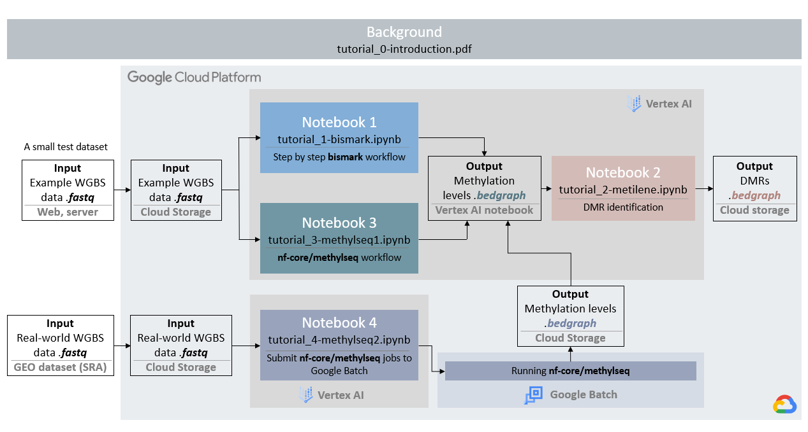
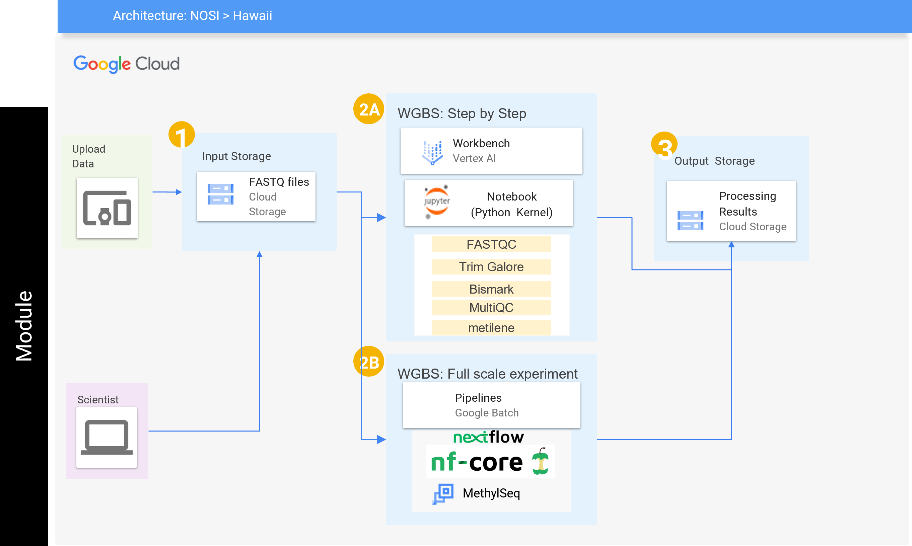

## **Contents**

+ [Overview](#overview)
+ [Background](#background)
+ [Before Starting](#before-starting)
+ [Getting Started](#getting-started)
+ [Software Requirements](#software-requirements)
+ [Architecture Design](#architecture-design)
+ [Data](#data)
+ [Funding](#funding)

## **Overview**

This module will show you how to run a whole genome bisulfite sequencing (WGBS) data analysis workflow on Google Cloud Platform (GCP). In addition to the overview given in this README you will find four Jupyter notebooks that help you understand the basics of the workflow to running large dataset using Google Batch in the cloud. To use this module, clone the parent repository, `git clone https://github.com/NIGMS/DNA-Methylation-Sequencing-Analysis-with-WGBS.git` and then navigate to the directory for this project. You will then see the following notebooks in your environment:

- **Introduction of DNA methylation** (`tutorial_0-introduction.pdf`): more background of DNA methylation and WGBS data analysis.

- **Notebook 1**  (`tutorial_1-bismark.ipynb`): using the Bismark workflow to extract the methylation percentage at each position from the raw FASTQ sequences. This tutorial will use a small example to walk through the process step by step.
(Running time: ~50 mins)
- **Notebook 2** (`tutorial_2-metilene.ipynb`): using metilene to identify differential methylated regions (DMRs) from the methylation profiles generated from Notebook 1. This workflow requests at least two samples.
(Running time: < 3 mins)
- **Notebook 3** (`tutorial_3-methylseq1.ipynb`): run the existing workflow methylseq developed by nf-core. This workflow is built using [Nextflow](https://www.nextflow.io/docs/latest/index.html), and is highly automated and portable.  
(Running time: ~50 mins)
- **Notebook 4** (`tutorial_4-methylseq2.ipynb`): run  the nf-core/methylseq workflow using Google Batch, which enables the workflows to use highly scalable and compliant infrastructure in the Google Cloud Platform.
(Running time: ~3 hrs)

This whole module will only cost you about $2.00 to run, assuming you tear down all resources upon completion.

Watch this [Introduction Video](https://youtu.be/S3ZIhO8k4ag) to learn more about the module.

## **Before Starting**
These tutorials were designed to be used on Google Cloud Platforms (GCP), with the aim of requiring nothing but the files within this GitHub repository. However, you do need to set up your Google account to access GCP and the Vertex AI Workbench to use the notebooks. The steps you need before getting started:
- Set up a Google Cloud account
- Create a project
- Enable billing
- Enable APIs (Compute Engine API, Cloud Storage API, Google Batch)
- Create a Nextflow service account (only needed for tutorial 4)
- Create a Cloud Storage bucket ([details](https://cloud.google.com/storage/docs/creating-buckets))

More detailed instructions of the above steps can be found [here](docs/Before_beginning.md). Or you can also refer to [NIH Cloud Lab README](https://github.com/STRIDES/NIHCloudLabGCP) for more instructions.

## **Getting Started**

This repository contains several notebook files which serve as bioinformatics WGBS workflow tutorials. To view these notebooks on GCP, the following steps will guide you through setting up a virtual machine on Google Cloud Platform, downloading our tutorial files, and running those files.

### Optional: Creating a Nextflow Service Account
If you are using Nextflow outside of NIH CloudLab you must set up a service account and add your service account to your notebook permissions before creating the notebook. Follow section 2 of the accompanying [How To document](https://github.com/NIGMS/NIGMS-Sandbox/blob/main/docs/HowToCreateNextflowServiceAccount.md) for instructions. If you are executing this tutorial with an NIH CloudLab account your default Compute Engine service account will have all required IAM roles to run the nextflow portion.

### Creating a notebook instance 

Follow the steps highlighted [here](https://github.com/NIGMS/NIGMS-Sandbox/blob/main/docs/HowToCreateVertexAINotebooks.md) to create a new instance notebook in Vertex AI. Follow steps 1-8 and be especially careful to enable idle shutdown as highlighted in step 8. In step 7 in the Machine type tab, select n1-standard-4 from the dropdown box.

### Download the tutorials

To clone this repository, use the Git command `git clone https://github.com/NIGMS/DNA-Methylation-Sequencing-Analysis-with-WGBS.git` in the dropdown menu option in Jupyter notebook. Please make sure you only enter the link for the repository that you want to clone. There are other bioinformatics related learning modules available in the [NIGMS Repository](https://github.com/NIGMS).

This should download our repository, and the tutorial files inside, into a folder called `MethylSeqUH`. Double-click this folder now. Inside you will find all our tutorial files, which you can double-click and run.

### Running Tutorial Files

All our tutorial workflows are in [Jupyter notebook](https://docs.jupyter.org/en/latest/ "Juypter notebook documentation") format. To run these notebooks (.ipynb) you need only to double-click the tutorial files and this will open the Jupyter file in Jupyter notebook. From here you can run each section, or 'cell', of the code, one by one, by pushing the 'Play' button on the above menu.

Some 'cells' of code take longer for the computer to process than others. You will know a cell is running when a cell has an asterisk next to it **[*]**. When the cell finishes running, that asterisk will be replaced with a number which represents the order that cell was run in.

You can now explore the tutorials by running the code in each, from top to bottom. Look at the [Overview](#overview) section for a short description of each tutorial.

### Stopping Your Virtual Machine

When you are finished running code, you can turn off your virtual machine to prevent unneeded billing or resource use by checking your notebook and clicking the **Stop** button.

## **Architecture Design**

