Image adapted from https://doi.org/10.3389/fgene.2011.00106

# University of Hawaiʻi at Mānoa WGBS Module
---------------------------------

## **Contents**

+ [Overview](#overview)
+ [Background](#background)
+ [Before Starting](#before-starting)
+ [Getting Started](#getting-started)
+ [Software Requirements](#software-requirements)
+ [Architecture Design](#architecture-design)
+ [Data](#data)
+ [Funding](#funding)

## **Overview**

This module will show you how to run a whole genome bisulfite sequencing (WGBS) data analysis workflow on Google Cloud Platform (GCP). In addition to the overview given in this README you will find four Jupyter notebooks that help you understand the basics of the workflow to running large dataset using Google Life Sciences API in the cloud. To use this module, clone the parent repository, `git clone https://github.com/NIGMS/DNA-Methylation-Sequencing-Analysis-with-WGBS.git` and then navigate to the directory for this project. You will then see the following notebooks in your environment:

- **Introduction of DNA methylation** (`tutorial_0-introduction.pdf`): more background of DNA methylation and WGBS data analysis.

- **Notebook 1**  (`tutorial_1-bismark.ipynb`): using the Bismark workflow to extract the methylation percentage at each position from the raw FASTQ sequences. This tutorial will use a small example to walk through the process step by step.
(Running time: ~50 mins)
- **Notebook 2** (`tutorial_2-metilene.ipynb`): using metilene to identify differential methylated regions (DMRs) from the methylation profiles generated from Notebook 1. This workflow requests at least two samples.
(Running time: < 3 mins)
- **Notebook 3** (`tutorial_3-methylseq1.ipynb`): run the existing workflow methylseq developed by nf-core. This workflow is built using [Nextflow](https://www.nextflow.io/docs/latest/index.html), and is highly automated and portable.  
(Running time: ~50 mins)
- **Notebook 4** (`tutorial_4-methylseq2.ipynb`): run  the nf-core/methylseq workflow using Google Life Sciences API, which enables the workflows to use highly scalable and compliant infrastructure in the Google Cloud Platform.
(Running time: ~3 hrs)

This whole module will only cost you about $2.00 to run, assuming you tear down all resources upon completion.

Watch this [Introduction Video](https://youtu.be/S3ZIhO8k4ag) to learn more about the module.

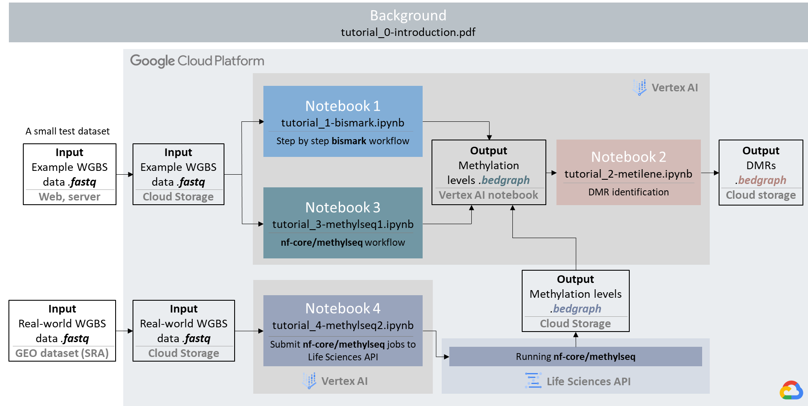

## **Background**

As one of the most abundant and well-studied epigenetic modifications, DNA methylation plays an essential role in normal cell development and has various effects on transcription, genome stability, and DNA packaging within cells.
- **DNA Methylation** refers to the addition of a methyl (CH3) group to the 5th carbon on a cytosine ring giving rise to 5-methylcytosine (5mC). The whole process is mediated by DNA methyltransferases (DNMTs):

- DNA methylation primarily happens at **CpG** sites, where a cytosine is followed by a guanine in the 5’-3’ direction (5’-Cytosine-phosphate-Guanine-3’). And DNA regions have a high frequency of CpG sites are called *CpG island*.  Methylation can also occur at CHG and CHH sites, where "H" is A, C, or T.
- **Function.** DNA methylation effects on transcriptional regulation differ depending on the location of the CpG site (intragenic vs. promoter region vs enhancer). For example, there are extensive differences in DNA methylation patterning between normal and cancer cells across the entire genome. And this change in distribution collectively causes a suppression of tumor suppressor genes and concomitant increase in the expression of oncogenes, which drive tumorigenesis ([Skvortsova K, et al. 2019](https://portlandpress.com/essaysbiochem/article/63/6/797/221497/The-DNA-methylation-landscape-in-cancer)).

To measure DNA methylation, WGBS was developed with the next-generation sequencing technologies (NGS) and bisulfited-based technologies. The basic steps of WGBS include DNA extraction, bisulfite conversion, library preparation, sequencing, and bioinformatics analysis.
- A **bisulfite treatment** converts cytosines into uracils, but leaves methylated cytosines unchanged:

- Subsequently, methylation can be measured at single base pair resolution by quantifying the C-C positions reference-bisulfite treatment (methylated site) versus the positions that changed C-T reference-bisulfite treatment (unmethylated site).
- In this learning module, our focus is to process and analyze the sequencing data generated from WGBS experiments. The major steps include quality control, alignment, methylation calling and differentially methylated region detection. We'll introduce two workflows and show how to run them on GCP, with detailed explanation how each step works in these workflows.

## **Before Starting**
These tutorials were designed to be used on Google Cloud Platforms (GCP), with the aim of requiring nothing but the files within this GitHub repository. However, you do need to set up your Google account to access GCP and the Vertex AI Workbench to use the notebooks. The steps you need before getting started:
- Set up a Google Cloud account
- Create a project
- Enable billing
- Enable APIs (Compute Engine API, Cloud Storage API, Cloud Life Sciences API)
- Create a Nextflow service account (only needed for tutorial 4)
- Create a Cloud Storage bucket ([details](https://cloud.google.com/storage/docs/creating-buckets))

More detailed instructions of the above steps can be found [here](docs/Before_beginning.md). Or you can also refer to [NIH Cloud Lab README](https://github.com/STRIDES/NIHCloudLabGCP) for more instructions.

## **Getting Started**

This repository contains several notebook files which serve as bioinformatics WGBS workflow tutorials. To view these notebooks on GCP, the following steps will guide you through setting up a virtual machine on Google Cloud Platform, downloading our tutorial files, and running those files.

### Navigate to GCP and select a project

Before starting, make sure you have a Google account and have access to a Google Cloud Platform project. Once you have these, you can begin by first navigating to **https://console.cloud.google.com/** and logging in with your credentials. Then, in the top-left of the screen, navigate to `select a project`, and choose the project you would like to work on:

### Navigating to the Vertex AI Workbench

Once a project has been selected, we can navigate to the Vertex AI Workbench, this is where we can set up the virtual machine (Jupyter notebook). To get there, select the navigation menu, and navigate to `Vertex AI` under the Artificial Intelligence section. Within the `Vertex AI` submenu, select **Workbench**:

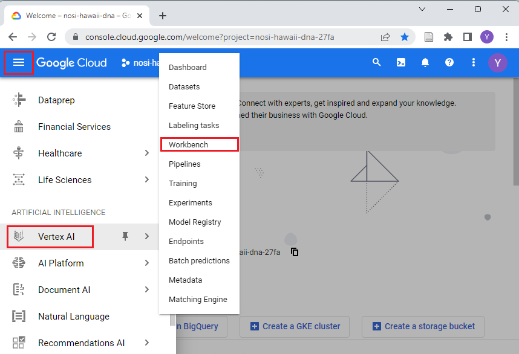

### Create a Vertex AI notebook

Vertex AI Workbench offers a `managed notebooks` option with built-in integrations that help you to set up an end-to-end notebook-based production environment. For users who need full control over their environment, Vertex AI Workbench provides a `user-managed notebooks` option.

Within the Workbench screen, select `USER-MANAGED NOTEBOOKS` and then create a new notebook by clicking `+ Create New` above:

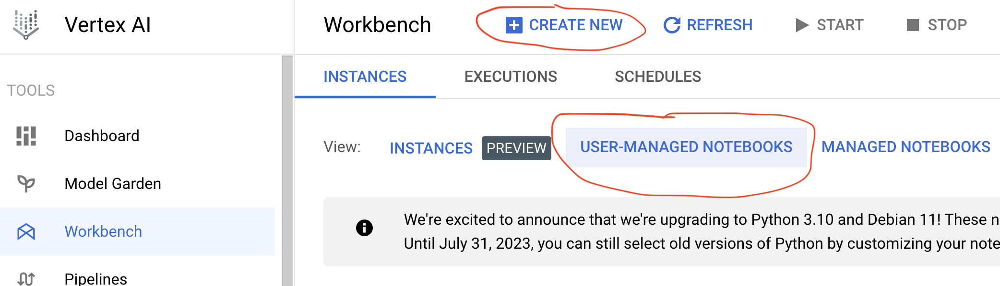

In the new instance window, scroll down and select Advanced Options.

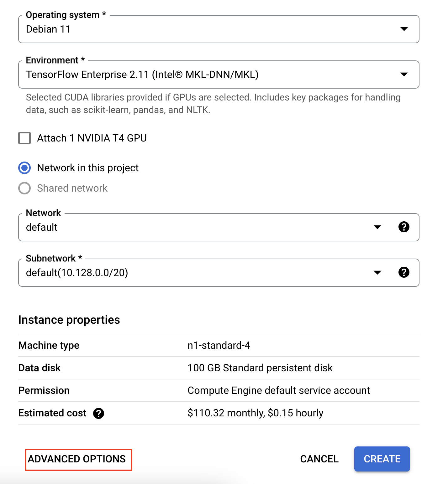

In the Environment tab, Select the appropriate operating system and environment. Make sure to click the Enable Idle Shutdown button in the Machine type tab as shown in the screenshot below. Finally, select the appropriate hardware in the Machine type tab.

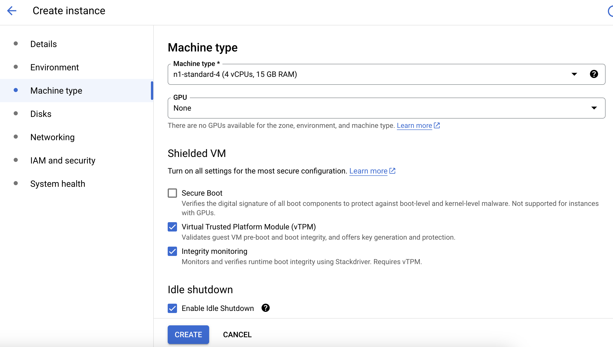

Select an instance type `Python 3` in the Environment tab. You can choose a name for your virtual machine, you can name it whatever you like, and preferably choose a server location closest to you. A default virtual machine with 4 vCPUS and 15GB RAM will be created.

Before creating a notebook, you need to edit the permissions to utilize the **Nextflow service account**.
- Using the 'IAM & Admin' tab on the left, click 'Service Accounts' (if you aren't there already), locate your Nextflow service account, and copy the entire email name
- Edit the Permissions section by **unclicking** 'Use Compute Engine default service account' and enter your service account email.
- then click 'Create'

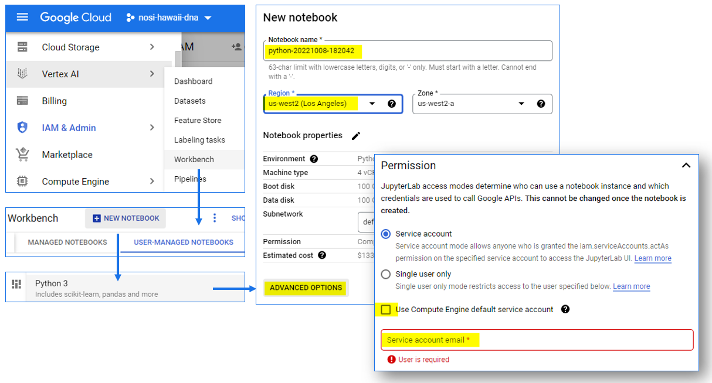

Vertex AI Workbench automatically starts the instance. It may take a few minutes to finish. When the instance is ready to use, Vertex AI Workbench activates an **Open JupyterLab link**:

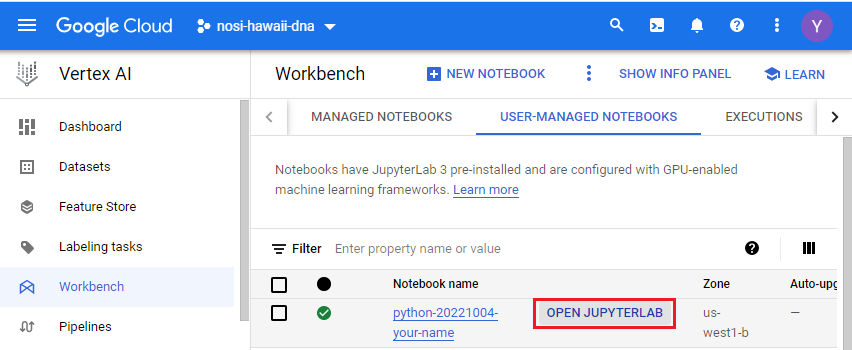

Start a new notebook by clicking the Python 3 Notebook icon:

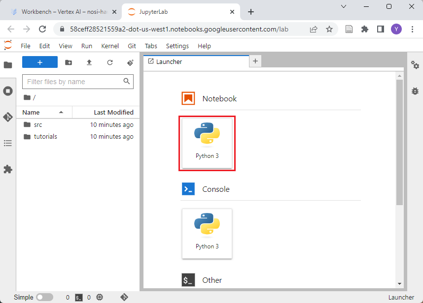

### Download the tutorials

Now that you have created your virtual machine, and are in the JupyterLab screen, you can run our tutorial files. But first you will need to download them.
The easiest way to do this would be to clone the NIGMS repository into your Vertex AI notebook. This can be done by using the `Git` menu in JupyterLab, and selecting the clone option. 
Next you can type in the link of repository: https://github.com/NIGMS/MethylSeqUH and click `Clone`. 

This should download our repository, and the tutorial files inside, into a folder called `MethylSeqUH`. Double-click this folder now. Inside you will find all our tutorial files, which you can double-click and run.

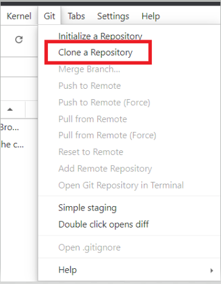

### Running Tutorial Files

All our tutorial workflows are in [Jupyter notebook](https://docs.jupyter.org/en/latest/ "Juypter notebook documentation") format. To run these notebooks (.ipynb) you need only to double-click the tutorial files and this will open the Jupyter file in Jupyter notebook. From here you can run each section, or 'cell', of the code, one by one, by pushing the 'Play' button on the above menu.

Some 'cells' of code take longer for the computer to process than others. You will know a cell is running when a cell has an asterisk next to it **[*]**. When the cell finishes running, that asterisk will be replaced with a number which represents the order that cell was run in.

You can now explore the tutorials by running the code in each, from top to bottom. Look at the [Overview](#overview) section for a short description of each tutorial.

### Stopping Your Virtual Machine

When you are finished running code, you can turn off your virtual machine to prevent unneeded billing or resource use by checking your notebook and clicking the 'Stop' button.
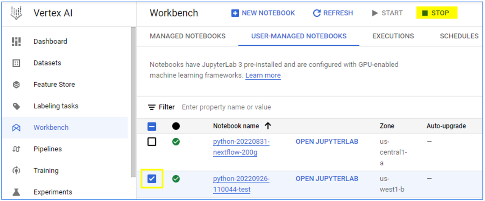

## **Software Requirements**

In this module, you will need access to a Jupyter notebook in GCP Vertex AI environment. The environment settings are listed here:
- Environment      : Python 3 (with Intel® MKL)
- Environment version      :M97
- IPython          :7.33.0
- ipykernel        :6.16.0
- jupyter_client   :7.3.5
- jupyter_core     :4.11.1
- jupyter_server   :1.19.1
- jupyterlab       :3.4.7
- nbclient         :0.6.8
- nbconvert        :7.0.0
- nbformat         :5.6.1
- notebook         :6.4.12
- traitlets        :5.4.0

For **Notebook 1 and 2**, you can install all necessary requirements using the instructions in Notebook 1, and the detailed software versions used in this tutorial (Oct, 2022) are listed here:
- conda 22.9.0 (pre-installed)
- mamba 0.27.0
- bedtools v2.30.0
- FastQC v0.11.9
- Bismark v0.23.1
- samtools 1.15.1
- htslib 1.16
- trim_galore 0.6.7
- Cutadapt 4.1
- metilene 0.2-8
- MultiQC v1.13
- Python 3.7.12

For **Notebook 3 and 4**, you will need to install Java and Nextflow in your notebook. Other software listed are included in the nfcore/methylseq pipeline, installation is not required, since they will be downloaded along with the pipeline.
- openjdk	17.0.3-internal
- Nextflow	v22.04.5
- nf-core/methylseq	v1.6.1
- Bismark genomePrep	v0.23.0
- FastQC	v0.11.9
- Cutadapt	v3.4
- Trim Galore!	v0.6.6
- Bismark	v0.23.0
- Bismark Deduplication	v0.23.0
- Bismark methXtract	v0.23.0
- Bismark Report	v0.23.0
- Bismark Summary	v0.22.4
- Samtools	v1.11
- BWA	v0.7.17-r1188
- bwa-meth	v0.2.2
- Picard MarkDuplicates	v1.6.1
- MethylDackel	v0.5.2 (using HTSlib version 1.11)
- Qualimap	v2.2.2-dev
- Preseq	v2.0.3
- MultiQC	v1.10.1
- HISAT2	v2.2.1

## **Architecture Design**

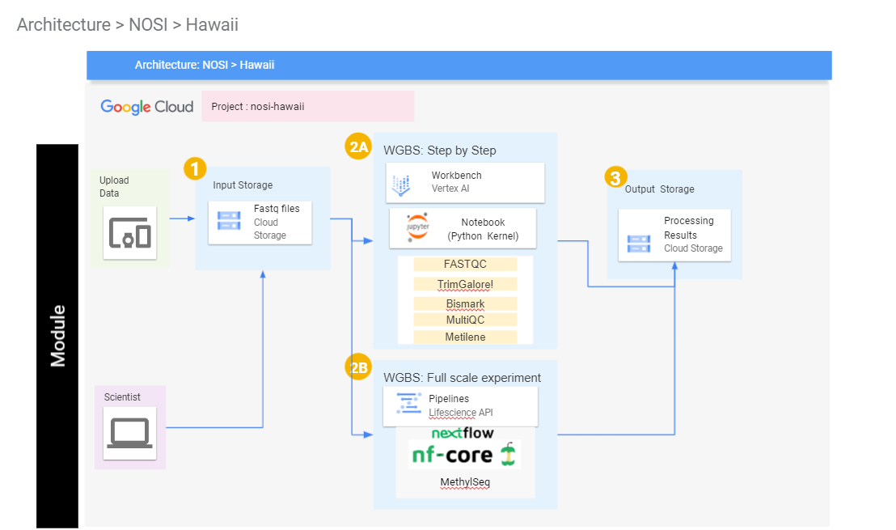

## **Data**

**Example dataset 1**: used in Notebook 1,2 and 3, was created by the [snakePipes WGBS pipeline](https://snakepipes.readthedocs.io/en/latest/content/workflows/WGBS.html) from paper: [Habibi, Ehsan, et al. Cell stem cell 13.3 (2013): 360-369](https://pubmed.ncbi.nlm.nih.gov/23850244/). There were four samples in this example dataset, two kinase inhibitors (2i) enables derivation of mouse embryonic stem cells (ESCs) vs. conventional ESCs maintained in serum. To streamline the tutorials the dataset were down sampled to only keep the reads from mouse genome chr6:4000000-6000000 and was stored in a Google Cloud Storage Bucket. Accordingly, the reference genome (.fasta file) from mouse GRCm39 chromosome 6 can be downloaded from NCBI or Ensemble websites, and was also stored in the same bucket.

**Example dataset 2**: used in Notebook 4. It was originally downloaded from the SRA database using the accession numbers SRR306435 and SRR033942. The data was from [Molaro, Antoine, et al. Cell 146.6 (2011): 1029-1041](https://www.sciencedirect.com/science/article/pii/S0092867411009421) and [Laurent, Louise, et al. " Genome research 20.3 (2010): 320-331](https://genome.cshlp.org/content/20/3/320.full). The studies profiled the methylomes of human and chimp sperm as a basis for comparison to methylation patterns of embryonic stem cells (ESCs). We use one sample from human sperm and one sample from ESCs as examples to demonstrate how to download these published datasets from SRA and process them using nf-core/methylseq in the Google Life Sciences API.

## **Funding**

Funded by NIH/NIGMS P20GM103466.

## **License for Data**

Text and materials are licensed under a Creative Commons CC-BY-NC-SA license. The license allows you to copy, remix and redistribute any of our publicly available materials, under the condition that you attribute the work (details in the license) and do not make profits from it. More information is available [here](https://tilburgsciencehub.com/about/#license).

This work is licensed under a [Creative Commons Attribution-NonCommercial-ShareAlike 4.0 International License](http://creativecommons.org/licenses/by-nc-sa/4.0/)
