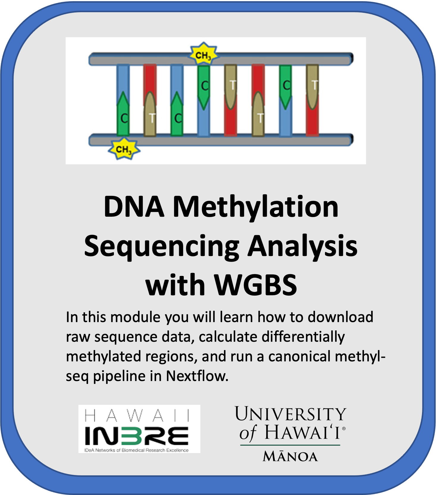
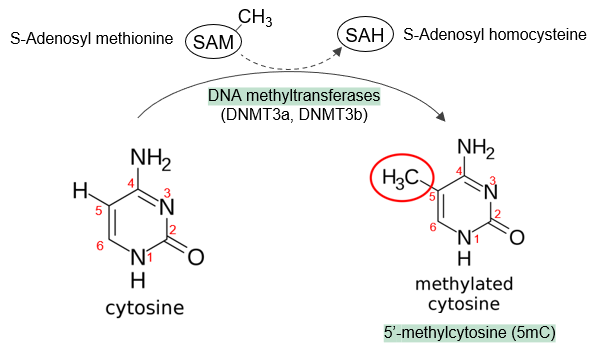
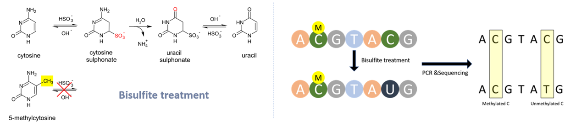

# University of Hawaiʻi at Mānoa WGBS Module

 

    

Image adapted from https://doi.org/10.3389/fgene.2011.00106

## **Contents**

+ [Overview](#overview)
+ [Software Requirements](#software-requirements)
+ [Data](#data)
+ [Funding](#funding)
+ [License for Data](#license-for-data)

## **Overview**

As one of the most abundant and well-studied epigenetic modifications, DNA methylation plays an essential role in normal cell development and has various effects on transcription, genome stability, and DNA packaging within cells.
- **DNA Methylation** refers to the addition of a methyl (CH3) group to the 5th carbon on a cytosine ring giving rise to 5-methylcytosine (5mC). The whole process is mediated by DNA methyltransferases (DNMTs):

- DNA methylation primarily happens at **CpG** sites, where a cytosine is followed by a guanine in the 5’-3’ direction (5’-Cytosine-phosphate-Guanine-3’). And DNA regions have a high frequency of CpG sites are called *CpG island*.  Methylation can also occur at CHG and CHH sites, where "H" is A, C, or T.
- **Function.** DNA methylation effects on transcriptional regulation differ depending on the location of the CpG site (intragenic vs. promoter region vs enhancer). For example, there are extensive differences in DNA methylation patterning between normal and cancer cells across the entire genome. And this change in distribution collectively causes a suppression of tumor suppressor genes and concomitant increase in the expression of oncogenes, which drive tumorigenesis ([Skvortsova K, et al. 2019](https://portlandpress.com/essaysbiochem/article/63/6/797/221497/The-DNA-methylation-landscape-in-cancer)).

To measure DNA methylation, WGBS was developed with the next-generation sequencing technologies (NGS) and bisulfited-based technologies. The basic steps of WGBS include DNA extraction, bisulfite conversion, library preparation, sequencing, and bioinformatics analysis.
- A **bisulfite treatment** converts cytosines into uracils, but leaves methylated cytosines unchanged:

- Subsequently, methylation can be measured at single base pair resolution by quantifying the C-C positions reference-bisulfite treatment (methylated site) versus the positions that changed C-T reference-bisulfite treatment (unmethylated site).
- In this learning module, our focus is to process and analyze the sequencing data generated from WGBS experiments. The major steps include quality control, alignment, methylation calling and differentially methylated region detection. We'll introduce two workflows and show how to run them on GCP, with detailed explanation how each step works in these workflows.

## **Software Requirements**

In this module, you will need access to a Jupyter notebook in GCP Vertex AI environment. The environment settings are listed here:
- Environment      : Python 3 (with Intel® MKL)
- Environment version      :M97
- IPython          :7.33.0
- ipykernel        :6.16.0
- jupyter_client   :7.3.5
- jupyter_core     :4.11.1
- jupyter_server   :1.19.1
- jupyterlab       :3.4.7
- nbclient         :0.6.8
- nbconvert        :7.0.0
- nbformat         :5.6.1
- notebook         :6.4.12
- traitlets        :5.4.0

For **Notebook 1 and 2**, you can install all necessary requirements using the instructions in Notebook 1, and the detailed software versions used in this tutorial (Oct, 2022) are listed here:
- conda 22.9.0 (pre-installed)
- mamba 0.27.0
- bedtools v2.30.0
- FastQC v0.11.9
- Bismark v0.23.1
- samtools 1.15.1
- htslib 1.16
- trim_galore 0.6.7
- Cutadapt 4.1
- metilene 0.2-8
- MultiQC v1.13
- Python 3.7.12

For **Notebook 3 and 4**, you will need to install Java and Nextflow in your notebook. Other software listed are included in the nfcore/methylseq pipeline, installation is not required, since they will be downloaded along with the pipeline.
- openjdk	17.0.3-internal
- Nextflow	v22.04.5
- nf-core/methylseq	v1.6.1
- Bismark genomePrep	v0.23.0
- FastQC	v0.11.9
- Cutadapt	v3.4
- Trim Galore!	v0.6.6
- Bismark	v0.23.0
- Bismark Deduplication	v0.23.0
- Bismark methXtract	v0.23.0
- Bismark Report	v0.23.0
- Bismark Summary	v0.22.4
- Samtools	v1.11
- BWA	v0.7.17-r1188
- bwa-meth	v0.2.2
- Picard MarkDuplicates	v1.6.1
- MethylDackel	v0.5.2 (using HTSlib version 1.11)
- Qualimap	v2.2.2-dev
- Preseq	v2.0.3
- MultiQC	v1.10.1
- HISAT2	v2.2.1

## **Data**

**Example dataset 1**: used in Notebook 1,2 and 3, was created by the [snakePipes WGBS pipeline](https://snakepipes.readthedocs.io/en/latest/content/workflows/WGBS.html) from paper: [Habibi, Ehsan, et al. Cell stem cell 13.3 (2013): 360-369](https://pubmed.ncbi.nlm.nih.gov/23850244/). There were four samples in this example dataset, two kinase inhibitors (2i) enables derivation of mouse embryonic stem cells (ESCs) vs. conventional ESCs maintained in serum. To streamline the tutorials the dataset were down sampled to only keep the reads from mouse genome chr6:4000000-6000000 and was stored in a Google Cloud Storage Bucket. Accordingly, the reference genome (.fasta file) from mouse GRCm39 chromosome 6 can be downloaded from NCBI or Ensemble websites, and was also stored in the same bucket.

**Example dataset 2**: used in Notebook 4. It was originally downloaded from the SRA database using the accession numbers SRR306435 and SRR033942. The data was from [Molaro, Antoine, et al. Cell 146.6 (2011): 1029-1041](https://www.sciencedirect.com/science/article/pii/S0092867411009421) and [Laurent, Louise, et al. " Genome research 20.3 (2010): 320-331](https://genome.cshlp.org/content/20/3/320.full). The studies profiled the methylomes of human and chimp sperm as a basis for comparison to methylation patterns of embryonic stem cells (ESCs). We use one sample from human sperm and one sample from ESCs as examples to demonstrate how to download these published datasets from SRA and process them using nf-core/methylseq in the Google Life Sciences API.

## **Funding**

Funded by NIH/NIGMS P20GM103466.

## **License for Data**

Text and materials are licensed under a Creative Commons CC-BY-NC-SA license. The license allows you to copy, remix and redistribute any of our publicly available materials, under the condition that you attribute the work (details in the license) and do not make profits from it. More information is available [here](https://tilburgsciencehub.com/about).

This work is licensed under a [Creative Commons Attribution-NonCommercial-ShareAlike 4.0 International License](http://creativecommons.org/licenses/by-nc-sa/4.0/)
